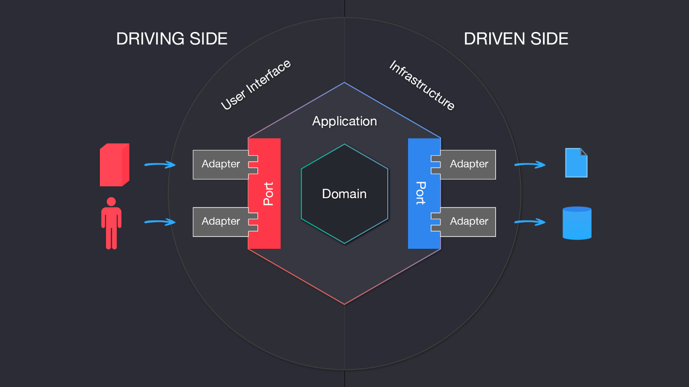

# Temper.works backend coding challenge

## What is it about?
This project is about to build an application based on an API for a parking.

The user is able to park and unpark a vehicle. If the parking is full the user receives a message saying that no spots are available.

## Chosen architecture
The architecture chosen for developing this project is the **Hexagonal** one.

*Why did I make this choice?*
The answer is pretty easy; it respects the S.O.L.I.D. principles and allows to separate the different layers of the application.

I've structured my project using different *adapters* for the *driving side* to communicate via *ports* with the *application*, and *ports on the application* that communicate with the *driven side* via *ports on the application* isolating the *domain* of the application.

As a primary adapter I created one controller (`Adapters/Controllers/ParkingController.php`) that gets and manages every different request for performing the allowed actions.

This controller instantiates every service and calls the method on them for doing the desired action. In every function I made a validation of the input data from the `request` for making sure no incorrect data is introduced. If the data type doesn't match the desired one it throws an `exception`.

`ParkingController` calls the function on the service passing a `DTO` with the desired data for assure scalability and *guarding the data types*. It uses the secondary adapter (`Adapters/Repositories/DataPersistHelper.php`) for performing the desired actions on the external actors (driven side); in this case would be persisting the data on the cache.

Once the desired actions are done, the service returns the desired data for the controller, isolating completely the `Domain` part of the application.

## Tests
Tests can be found on the `Tests` folder. I only tested the services for making sure they do the desired actions.

For running them run `docker compose exec app vendor/bin/phpunit tests`

## Running the project
First of all we need to open a terminal and go until the root of the project. Once there run:
`docker compose up -d`. Two containers will get mounted and initialized (one for PHP, one for nginx).

To install the project requirements via composer execute the terminal of the `app` container and run `composer install`

For parking a vehicle inside the parking, make a POST cURL request to `http://127.0.0.1:8080/api/park/{license_plate}` changing `{license_plate}` with a string.
For unparking a vehicle from the parking, make a POST cURL request to `http://127.0.0.1:8080/api/unpark/{license_plate}` changing `{license_plate}` with a string.

## Decisions
As no many requirements were asked I had to make some assumptions:

- The parking has only one level, this level has 10 parking spots.
- In the parking only cars can park.

